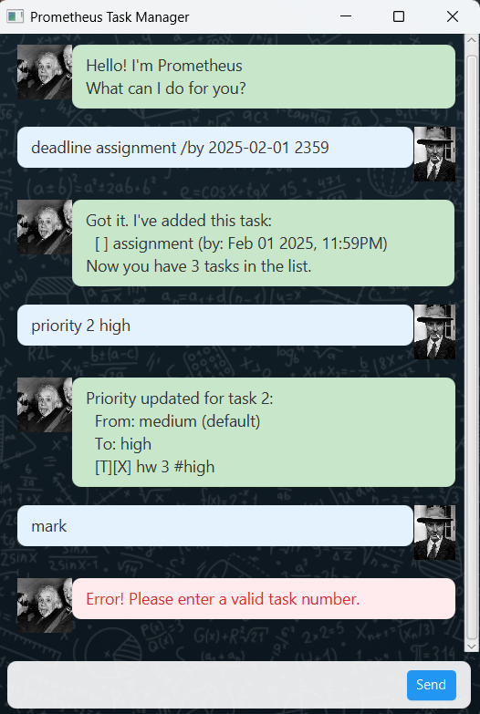

# Prometheus



Prometheus is a desktop chatbot application designed to help you manage your tasks efficiently. With a clean and intuitive interface, you can easily add, track, and complete your to-dos, deadlines, and events.

## Features

Prometheus supports a variety of commands to manage your tasks.

### Adding a todo

To add a task without a specific date or time:
`todo <description>`

Example:
`todo read a book`

Expected output:
```
Got it. I've added this task:
  [T][ ] read a book
Now you have 1 task in the list.
```

### Adding deadlines

To add a task with a deadline:
`deadline <description> /by <date/time>`

The date/time can be in formats like `dd/MM/yyyy HHmm` or `yyyy-MM-dd`.

Example:
`deadline return library book /by 2025-09-20`

Expected output:
```
Got it. I've added this task:
  [D][ ] return library book (by: Sep 20 2025)
Now you have 2 tasks in the list.
```

### Adding events

To add an event with a start and end time:
`event <description> /from <start date/time> /to <end date/time>`

Example:
`event project meeting /from 2025-09-21 1400 /to 2025-09-21 1600`

Expected output:
```
Got it. I've added this task:
  [E][ ] project meeting (from: Sep 21 2025, 14:00 to: Sep 21 2025, 16:00)
Now you have 3 tasks in the list.
```

### Listing all tasks

To see all the tasks you have added:
`list`

Expected output:
```
Here are the tasks in your list:
1.[T][ ] read a book
2.[D][ ] return library book (by: Sep 20 2025)
3.[E][ ] project meeting (from: Sep 21 2025, 14:00 to: Sep 21 2025, 16:00)
```

### Marking a task as done

To mark a task as completed:
`mark <task number>`

Example:
`mark 1`

Expected output:
```
Nice! I've marked this task as done:
  [T][X] read a book
```

### Unmarking a task

To change a task's status back to not done:
`unmark <task number>`

Example:
`unmark 1`

Expected output:
```
OK, I've marked this task as not done yet:
  [T][ ] read a book
```

### Deleting a task

To remove a task from your list:
`delete <task number>`

Example:
`delete 2`

Expected output:
```
Noted. I've removed this task:
  [D][ ] return library book (by: Sep 20 2025)
Now you have 2 tasks in the list.
```

### Finding a task

To find tasks containing a specific keyword:
`find <keyword>`

Example:
`find book`

Expected output:
```
Here are the matching tasks in your list:
1.[T][ ] read a book
```

### Setting Task Priority

To set a priority level for a task:
`priority <task number> <high/medium/low>`

Example:
`priority 1 high`

Expected output:
```
Priority updated for task 1:
  From: medium (default)
  To: HIGH
  [T][ ] read a book
```

### Exiting the application
To close Prometheus:
`bye`

## Getting Started

1.  Ensure you have Java 11 or above installed.
2.  Download the latest `prometheus.jar` from the [releases page](https://github.com/Rihiz/ip)
3.  Run the application using the command: `java -jar prometheus.jar`

## Notes

The application will automatically save your tasks to `data/prometheus.txt` in the same directory as the JAR file.
